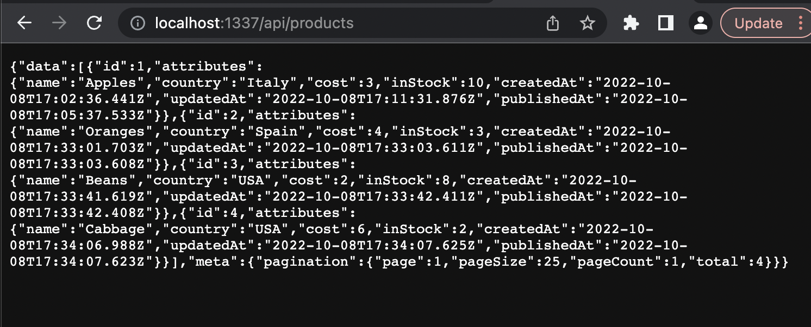
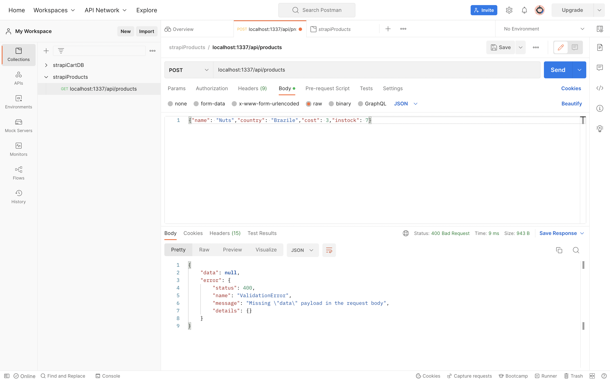
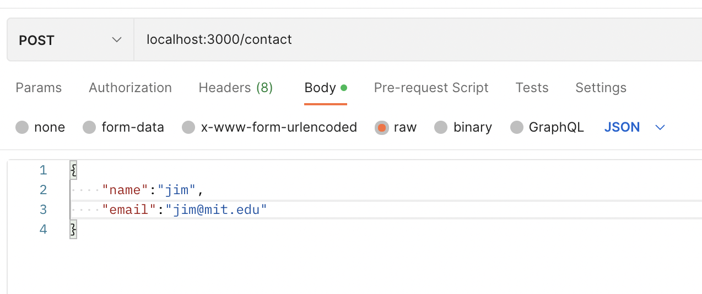

# week-19
MIT xPro Week 19 - Shopping Cart Excercise

In Module 19: Shopping Cart Exercise, you’re going to learn how to integrate a React front end with the back end and learn how to use tools like Strapi, Postman, Express, and node. You’ll use Strapi to create a Database, then use Express and Postman to set up and test the communication between Strapi and the front end.

1. Explain the relationship between the front end, API, and back end. 

2. Create a Strapi database 

3. Identify the functionality of Express, APIs, and Postman

4. Identify the role of the back end

5. Integrate Strapi with a React application

6. Use Postman to test API endpoints

#Links

[Strapi Documentation](https://docs.strapi.io/developer-docs/latest/getting-started/introduction.html)

[Strapi Discord Community](https://discord.com/invite/strapi)

[Strapi GitHub](https://github.com/strapi/strapi)

[Strapi Quickstart Guide](https://docs.strapi.io/developer-docs/latest/getting-started/quick-start.html#_1-install-strapi-and-create-a-new-project)

[Postman Learning Center](https://learning.postman.com)

[Explore Postman Public API Network](https://www.postman.com/explore)

[Postman Community](https://community.postman.com)

[Express GitHub](https://github.com/expressjs/express)

[NodeJS Documentation](https://nodejs.org/en/docs/)

[Picsum Photos](https://picsum.photos)

# My Bugs

Mac Terminal npm ERR resulting from this command. ```npx create-strapi-app@3 cartDB --quickstart```

```
npm ERR! code ERESOLVE
npm ERR! ERESOLVE unable to resolve dependency tree
npm ERR! 
npm ERR! While resolving: cart-db@0.1.0
npm ERR! Found: knex@0.19.5
npm ERR! node_modules/knex
npm ERR!   knex@"<0.20.0" from the root project
npm ERR! 
npm ERR! Could not resolve dependency:
npm ERR! peer knex@"^0.20.0" from strapi-connector-bookshelf@3.1.4
npm ERR! node_modules/strapi-connector-bookshelf
npm ERR!   strapi-connector-bookshelf@"3.1.4" from the root project
npm ERR! 
npm ERR! Fix the upstream dependency conflict, or retry
npm ERR! this command with --force, or --legacy-peer-deps
npm ERR! to accept an incorrect (and potentially broken) dependency resolution.
npm ERR! 
npm ERR! See /Users/mark/.npm/eresolve-report.txt for a full report.

npm ERR! A complete log of this run can be found in:
npm ERR!     /Users/mark/.npm/_logs/2022-10-06T21_00_42_202Z-debug-0.log
```

The worst part about the MIT xPro course is the instructions for setting up the system. It takes a lot of time to figure out how to install the programs. The instructions hardly ever work. In this case I went directly to strapi and found the following command to install Strapi and this solved my problem.

```npx create-strapi-app@latest my-project --quickstart```

2. Role and Permissions were changed to allow for "Public". This did not remove the error as shown in the instructions.
```{"data":null,"error":{"status":404,"name":"NotFoundError","message":"Not Found","details":{}}}```

There are two items not discussed in the video that were addressed in the [strapi documentation](https://docs.strapi.io/developer-docs/latest/getting-started/quick-start.html).
- You have to publish, not just save the products.
- The file path needs to include /api/products ```http://localhost:1337/api/products```

 </img>

3. Trashing the terminal resulted in losing the localhost:1337. I couldn't figure out how to get it back. The interfered with Postman accessing the strapi database. Searched for solution online but couldn't find one. Probably basic stuff, but I have no idea. So I deleted the cartDB directory and recreated the strapi cartDB in order complete the assignment.

4. Postman POST resulted in error. Not sure where to look for a resolution.

 </img>


### How React Ties Into Backend Systems And API 

So far in this course, you built various web components, some of which displayed data on a page and others that allowed users to add, edit, or remove data from the page. 

All these applications live on your local computer so others cannot access them. If you want to take these applications to the real world where actual users can interact with them, you will need to build a back end to go with the front end you have already created.  

What’s The Difference Between Front End and Back End? 

You can understand the difference between the front end and the back end through the restaurant experience. Here’s the general idea: Just like there is a menu, waitstaff, and kitchen staff in a restaurant, your web application divides responsibilities between the front end and back end.

 </img>

The waitstaff is focused on connecting with clients and creating a good customer experience. They give each customer a menu and respond to their requests. You can think of the menu as the front end, which a user interacts with, and the waiter as an API. The front end and API work together to create a user experience and allow your users to interact with the data you have.

The kitchen staff cooks quality meals efficiently. You can think of them as the back end. This is where the data that you serve to your users is created and stored.

In web development, the back end is also referred to as server-side and the front end as client-side.

To review: 
Front end: The front end creates a user interface. This is what your customers see when they use your application. It is a set of controlled interactions that you design. Think of it like the menu in the restaurant. React is the tool you’ve used so far in this course to create a front-end application.

APIs: Users can browse the front end to determine which interaction they’d like to initiate. They will need a way to communicate with the back end.This is where APIs come into play. They provide a way for your web page to talk to your data source, much like a waiter taking an order and relaying it to the kitchen staff.

Back end: Once the order is in the kitchen, the staff needs to determine which ingredients are required and then proceed to make the requested items as efficiently as possible. The user never sees any of this work. Similarly, a server, which is just a computer connected to the internet, must organize the data from your web application to send the right response at the right time. When the response is ready, it is sent back to the client-side through the API.

Another analogy is a stock room.

Front End: The service window where a worker requests materials and provides a work order number.

API: The stockroom clerk takes the information and collects the materials from the shelf and sends notifications to purchasing to account for the the sell of the item and update the inventory.

Back End: Purchasing receives the notification and charges the money to the work order and buys new materials to update the inventory.

### Video 19-1 Introduction to the Shopping Cart Excersise

In this exercise, you’ll learn how to integrate React with the back end. You’ll use some starter code for the shopping cart application and set up the back end database with Strapi and Postman. At the end of the week, you’ll build a restocking feature for the shopping cart.

Develop an shopping cart app. Create a store with a checkout. Replenish the store when stock runs low by getting a handle on a remote database. Set up a database using Strapi which provides an application program interface(API) to retrieve stock from a database. Use Postman to work with Strapi, and make new requests and push new data into the Strapi database. The focus is on the shopping cart, and the React app.

Wheel the cart through the shop. The shelves will be stocked with goods, take goods from the shelves and put them into the shopping cart. The stock in the store will decrease as the items in our shopping cart will increase. Track the checkout total to know how much is purchased.

Ther are three parts. The App is designed in one component. 

1. The store that's keeping track of the stock

2. The cart that's keeping track of what's in it.

3. The checkout total that we need to provide when we check out.

### Video 19-2 Create Strapi Product Database

In this video, you’ll install Strapi and create a product database for the shopping cart. In order to set up Strapi, you'll need to have already downloaded [node](https://nodejs.org/en/download/).

The cart interface is provided. Connect the cart to the database. Host the data in Strapi, which allows the creation of an API that is accessed via fetch commands from the cart. 

1. Install [Strapi](https://strapi.io/). This will give you a good introduction as a quick guide here how to get Strapi running in three minutes.

- Check terminal to see if node.js, npm, powershell is installed. ```node -v``` ```npm -v``` ```pwsh```

I had to install powershell which requires HomeBrew. ```brew -v``` It is there so all I need to do is install powershell with this command.

```brew install powershell --cask```

- first, create a directory. We need to be in an empty directory. Bring up a terminal window, navigate to where you want to put the directory, then ```mkdir``` and the name of the directory.
- 'cd' into 'cartDB'.
- build Strapi with ```npx create-strapi-app@latest cartDB --quickstart```. Give it the name of the directory ```cartDB```.
- Then quickstart with ```- -quickstart```. It's building using Webpack. And you can see that we can run these various commands to start. ```npm run start```, ```npm run develop```. And this is the one we're going to use in the future. Strapi has stood up a server and we'll see that it's running on ```localhost:1337```.
- Fill in your name, password, and confirmation of the password.
- Start and begin to create content. Strapi is up and running.


2. Build products.
```
name:
country:
cost:
instock:
```

3. Build content type. Click on Content- Types Builder and create a new collection type. Product needs a name=text, country=text, cost=number with decimal format, instock=number as integer.

4. Set up new Products

- Apples, Italy, cost of 3, 10 in stock.
- Oranges. Country, Spain. Cost, 4 and Instock, 3. Save that. So, you see we've got them already. And now, 
- Beans. Country, USA. Cost, 2. Instock, 8. And we'll add one more.

5. Strapi automatically sets up an API at this server called products. Open the browser and goto localhost.

```http://localhost:1337/products``` Reference My Bugs for the solution.

6. Goto Roles & Permissions to give permissions. This one we want to give permissions to Public. Select them all. I'm going to allow Public to hit count, find, create, delete. No you can see the products. It has a few extra fields like creation date, username, and firstname.

Role and Permissions were changed to allow for "Public". This did not remove the error as shown in the instructions.
```{"data":null,"error":{"status":404,"name":"NotFoundError","message":"Not Found","details":{}}}```. Ref My Bugs for the solution.

7. To manage your project 🚀, go to the administration panel at:
```http://localhost:1337/admin```

### Video 19-3 Postman

[Download Postman App](https://www.postman.com/downloads/)

Use Postman to send, GET and POST messages to any URL. Talk to Strapi as a database through this API. Postman also provides the code for GET and POST, which can help with debugging.

1. GET, Send a request to ```localhost:1337/api/products```. The product data appears in the body.

2. POST, Send a request to to ```localhost:1337/api/products```. The product data appears in the body and updates the product database.
    - Header KEY and VALUE: Content-Type: application/json.
    - Body: Choose "raw" object to send in "JSON" format. "nuts", in quotes, these others are numbers. "id" is overwritten to ensure a unique "id".
    - Got to localhost:1337 and LOG IN. Nuts were added.

3. Code: Look at code to make the request in different formats. You need the Headers.

### Video 19-4 Using Postman and Express Web Server

Postman is a tool to confirm that your API is sending and receiving data properly, through HTTP verbs like GET and POST

Express is a server-side framework for Node.js that facilitates easy communication between client-side software and a database.

Express uses routes to send and receive data between a database and the client.

An API ends data from the front end to the back end of an application and vice versa.

The back end contains an application’s business logic.

The back end is responsible for routing data between a database and a client.

The back end stores and retrieves the necessary data for the front-end section of an application.

A back end can consist of an API that is responsible for sending and receiving data from the front-end section of the application.

```git clone https://github.com/johntango/c2express01.git```

```cd c2express01```

```npm install```

Run web server ```node contacts.js```

Open Postman App and create ExpressWebServer Collection
- Get ```localhost:3000```. You will see the instructions pop up in the body. POST to /contact and GET /contacts
- Try to POST

 </img>

### Video 19-5 Shopping Cart Exercise - Refactor Introduction 

There are several ways you can refactor the Shopping Cart application. These are optional as you will focus on building the restocking functionality in this week's assignment. 

1. Import random images from [picsum](https://picsum.photos).
2. List the price and stock of each item. If stock goes to 0, then don't allow item to go to the cart.
3. Add the price at Checkout.
4. Build the delete functionality: deleting an item from the cart should cause checkout to restock the item.
5. Add stock.

Consider the user interface. Are there adaptations you could make to the delete functionality to make it more intuitive to the user? How can you prevent users from accidentally deleting items from their cart?

In this exercise, you’ll focus on building that restocking functionality. To accomplish this, you’ll need to make a call to a Strapi API and get a fresh list of available products.

Here’s how the reset stock feature works:

- There’s an input field on the page that contains the URL to the Strapi back end
- When a user clicks the “ReStock Products” button, a call is made to the Strapi back end specified in the input field
- The result of this call is an updated list of products

Your task is to implement the restock feature. You should add your code to the “cart.jsx” file. More specifically, you need to implement the “restockProducts” function. 

Hints:

Make use of the “doFetch” function to make a call to the API
Make use of “setItems” to update the existing items

Reference directory ```week-19/restock-shopping-cart_starter```

### Video 19-5  Shopping Cart Exercise - Refactor Restocking Functionality

1. Product Web Component

If restocked, then the ```{list}``` needs to hav the new products.

```
<h1>Product List</h1>
<ul style={{ listStyleType: "none" }}>{list}</ul>
```

The cartlist
```
<h1>Cart Contents</h1>
<Accordion defaultActiveKey="0">{cartList}</Accordion>
```

The form to restock the products. onSubmit, call restockProducts from the strapi database with ```/${query}```
```
<form
    onSubmit={(event) => {
        restockProducts(`http://localhost:1337/${query}`);
        console.log(`Restock called on ${query}`);
        event.preventDefault();
        }}
>
    <input
        type="text"
        value={query}
        onChange={(event) => setQuery(event.target.value)}
    />
    <button type="submit">ReStock Products</button>
</form>
```
restockProduct function is called by the onsubmit event which provides the url. The doFetch function sets the URL with useState. When the useState is changed, it triggers the fetch. ```data``` is the array of new products. Use map to pick out each item of the products. Desctructure ```let { name, country, cost, instock } = item``` to limit the items to name, country, cost, instock as a new object. To setItems, spread the existing items and add the newItems. ```setItems([...items, ...newItems])``` When setItems is changed, the items are changed. The next time the list of items is rendered, the list function returns the product image, button with item name and cost, submit with item name with an onClick event to call addToCart. Change so that they are randomly accessed from picsum.

What is doFetch? Is it a function? Where and how is it defined?

```
const restockProducts = (url) => {
    doFetch(url);
    let newItems = data.map((item) => {
      let { name, country, cost, instock } = item;
      return { name, country, cost, instock };
    });
    setItems([...items, ...newItems]);
  };
```
Fetch from the useDataApi function useEffect. It is called when we change the url because it is told to track the url and fetch data when it changes.